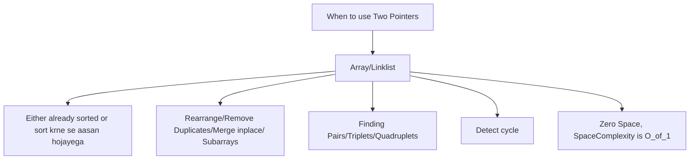

```mermaid
graph TD;
    A[When to use Two Pointers]-->B[Array/Linklist];
    B-->C[Either already sorted or sort krne se aasan hojayega];
    B-->D[Rearrange/Remove Duplicates/Merge inplace/ Subarrays];
    B-->E[Finding Pairs/Triplets/Quadruplets];
    B-->F[Detect cycle];
    B-->G[Zero Space, SpaceComplexity is O_of_1];
```
