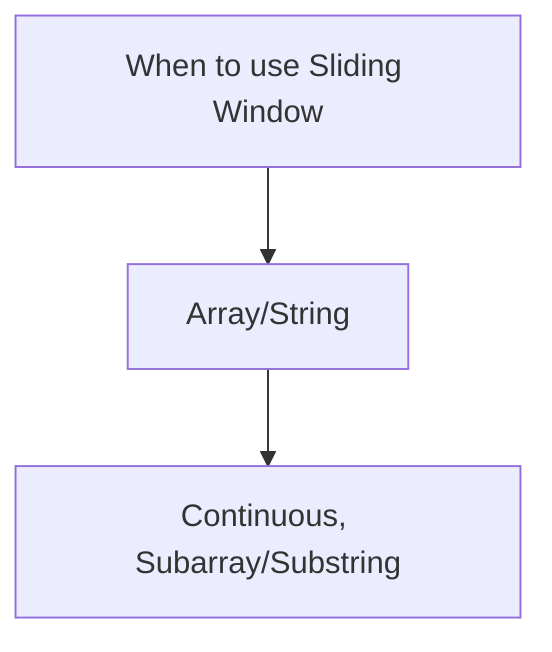
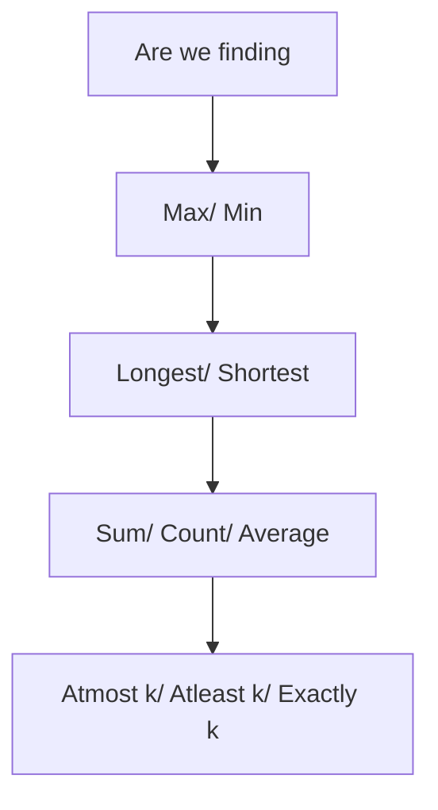
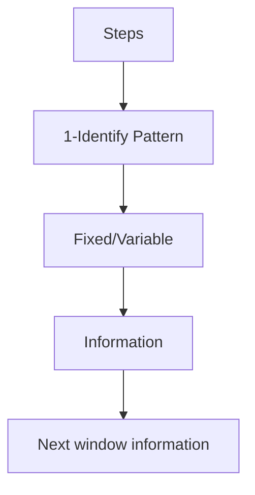

```mermaid
graph TD;
    A[When to use Sliding Window]-->B[Array/String];
    B-->C[Continuous, Subarray/Substring];
```

```mermaid
graph TD;
    A[Are we finding]-->B[Max/ Min];
    B-->C[Longest/ Shortest];
    C-->D[Sum/ Count/ Average];
    D-->E[Atmost k/ Atleast k/ Exactly k];
```

```mermaid
graph TD;
    A[Steps]-->B[1-Identify Pattern];
    B-->C[Fixed/Variable];
    C-->D[Information];
    D-->E[Next window information];
```
