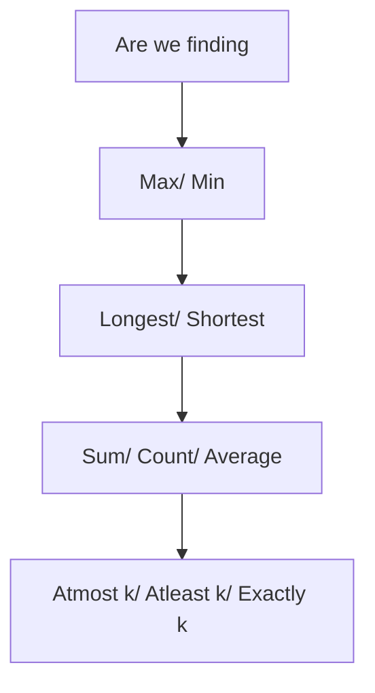

```mermaid
graph TD;
    A[When to use Sliding Window]-->B[Array/String, Not with Linklist];
    B-->C[Subarray/Substring(continuous)];
```

```mermaid
graph TD;
    A[Are we finding]-->B[Max/ Min];
    B-->C[Longest/ Shortest];
    C-->D[Sum/ Count/ Average];
    D-->E[Atmost k/ Atleast k/ Exactly k];
```
